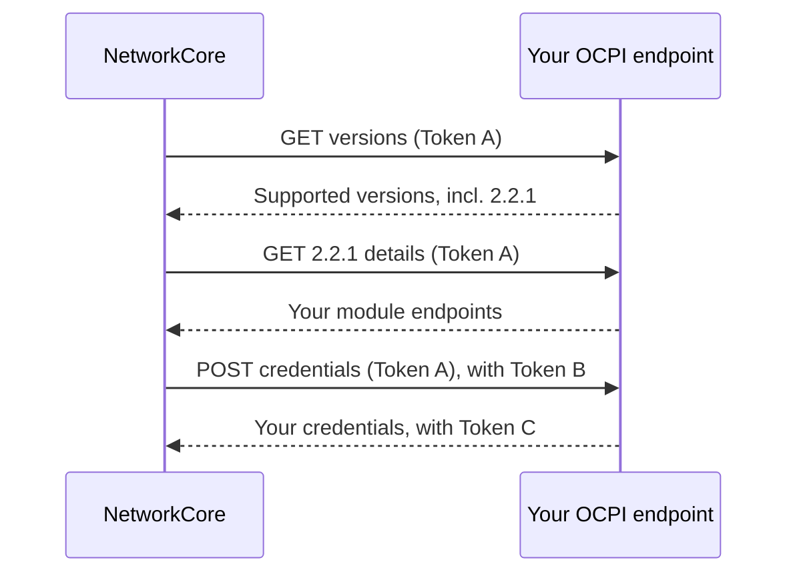
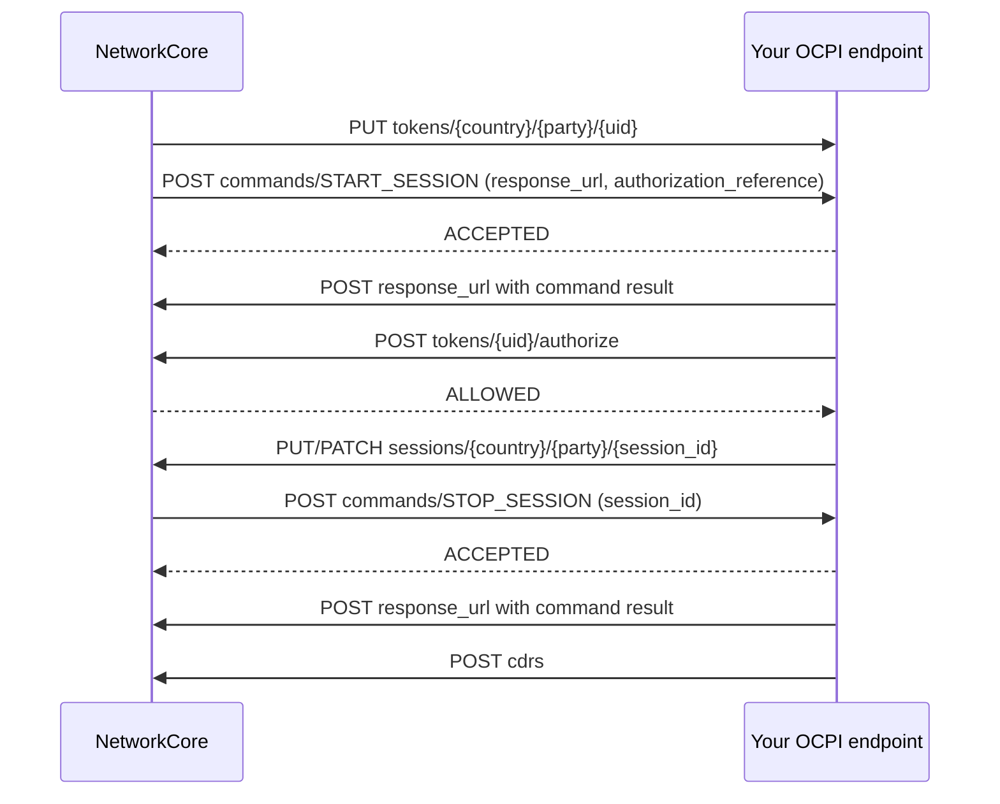

# CPO onboarding

How a charge point operator (CPO) connects to NetworkCore, and what happens on the wire once
charging starts.

NetworkCore connects to your network as an **eMSP** over **OCPI 2.2.1**. Drivers reach your
chargers through NetworkCore's distribution partners; you keep operating your network as usual.

> Before going live, run the [CPO sandbox checklist](/sandbox.html#charge-point-operators).

## Before you start

You need an OCPI 2.2.1 endpoint reachable over HTTPS that implements these modules:

| Module | Your role | Used for |
| --- | --- | --- |
| `credentials` | Receiver | The registration handshake |
| `locations` | Sender | Publishing your locations, EVSEs and connectors |
| `tariffs` | Sender | Publishing your prices |
| `tokens` | Receiver | Receiving NetworkCore driver tokens |
| `commands` | Receiver | Remote `START_SESSION` and `STOP_SESSION` |
| `sessions` | Sender | Pushing live session updates to NetworkCore |
| `cdrs` | Sender | Pushing charge detail records to NetworkCore |

## Step 1. Send us your connection details

Give your NetworkCore contact:

- **Business name**
- **Versions URL**, for example `https://ocpi.example.com/versions`. Must be HTTPS.
- **Token A**, a one-time credential NetworkCore uses to start the handshake. Share it through a
  secure channel, not plain email.

## Step 2. Credentials handshake

NetworkCore registers you and runs the OCPI credentials handshake automatically:



| Token | Issued by | Used by | Purpose |
| --- | --- | --- | --- |
| Token A | You | NetworkCore | Bootstrap only, for the handshake |
| Token B | NetworkCore | You | Every call you make to NetworkCore |
| Token C | You | NetworkCore | Every call NetworkCore makes to you |

Your connection is **Pending** while the handshake runs. It then becomes **Registered**, or
**Failed** with a reason we share with you. Every response in the handshake must carry OCPI
`status_code: 1000`, and your version details must advertise a `credentials` endpoint.

You may call NetworkCore with Token B as soon as you receive it, even before your credentials
response returns.

## Step 3. Authentication

All OCPI calls use the standard header, with the token Base64-encoded:

```
Authorization: Token <base64 token>
```

- You call NetworkCore with **Token B**.
- NetworkCore calls you with **Token C**.

Requests and responses carry `X-Request-ID` and `X-Correlation-ID`. NetworkCore echoes yours back,
or generates one if you did not send it.

## Step 4. Locations and tariffs

- **Locations** are pulled from your `locations` endpoint.
- **Tariffs** are pulled from your `tariffs` endpoint every hour. To publish a change sooner, push
  it to NetworkCore with `PUT /2.2.1/tariffs/{country_code}/{party_id}/{tariff_id}`.

List endpoints must support OCPI pagination: NetworkCore follows `Link: <...>; rel="next"` until
the last page. Always set `last_updated`; NetworkCore keeps the newest version of each tariff.

## Charging flow



1. **Driver token.** Before a driver's first charge on your network, NetworkCore pushes their token
   to your `tokens` endpoint. Tokens are type `APP_USER` with `whitelist: NEVER`, so authorize each
   charge in real time against NetworkCore.
2. **Start.** NetworkCore sends `START_SESSION` with a `response_url` and an
   `authorization_reference`. Answer `ACCEPTED` synchronously, then post the final result to the
   `response_url`.
3. **Authorize.** Call `POST /2.2.1/tokens/{uid}/authorize`. NetworkCore answers `ALLOWED` or
   `BLOCKED`, or `2004` for an unknown token.
4. **Session updates.** Push the session with `PUT` and keep it current with `PATCH`.
5. **Stop.** NetworkCore sends `STOP_SESSION` with your session `id`. Answer and post the result
   the same way as for start.
6. **CDR.** Post the charge detail record to `POST /2.2.1/cdrs` when the session ends.

### Requirements

- **Return `authorization_reference`** unchanged on every session and CDR. NetworkCore uses it to
  match your records to the charge that was started.
- **Send command results within 10 minutes.** After that, the command counts as timed out.
- **Always set `last_updated`** on sessions. Updates older than the stored version are ignored.
- **CDR IDs are final.** The first CDR received for an ID is kept, and a resend with the same ID
  does not replace it. Credit CDRs are held for manual review.
- **Price CDRs with the published tariff.** NetworkCore checks every CDR against the tariff in
  force when the session started and holds CDRs that drift from it.

## NetworkCore OCPI endpoints

Base URL: `https://ocpi.networkcore.org`. Interactive reference: `https://ocpi.networkcore.org/docs`.

| Method | Path | Purpose |
| --- | --- | --- |
| `GET` | `/versions` | Supported versions |
| `GET` | `/2.2.1/details` | Module endpoints |
| `POST` | `/2.2.1/commands/{uid}` | Command results (your `response_url`) |
| `POST` | `/2.2.1/tokens/{uid}/authorize` | Real-time token authorization |
| `PUT` | `/2.2.1/tariffs/{country_code}/{party_id}/{tariff_id}` | Tariff push |
| `GET` `PUT` `PATCH` | `/2.2.1/sessions/{country_code}/{party_id}/{session_id}` | Session push and read |
| `POST` | `/2.2.1/cdrs` | CDR push |

Every response follows the OCPI envelope: `status_code`, optional `status_message`, `timestamp`,
and `data`.
